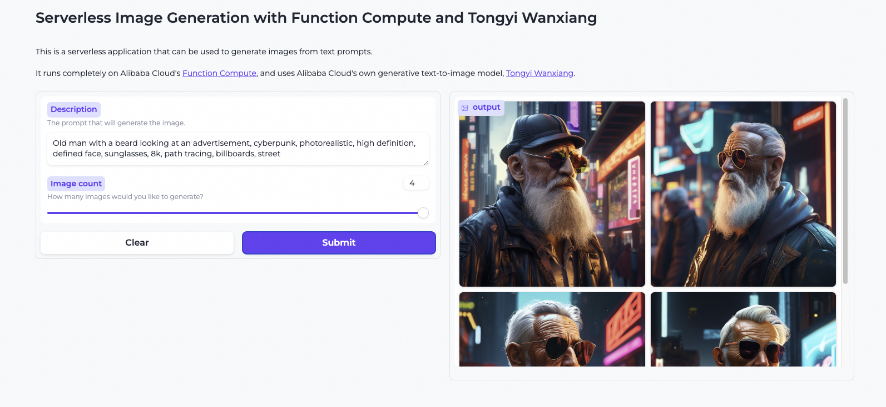

# Serverless Image Generation with Function Compute and Tongyi Wanxiang


This is a serverless application that can be used to generate images from text prompts. It runs completely on Alibaba Cloud's [Function Compute](https://www.alibabacloud.com/product/function-compute).

This project uses DashScope, Alibaba Cloud's Model as a Service (MaaS) platform, in combination with Alibaba Cloud's own generative text-to-image model, [Tongyi Wanxiang](https://tongyi.aliyun.com/wanxiang/).

## Demo
Looking for a live demo? Click [here](https://genaiwithali.cloud/).

## Application setup
### Installing dependencies
You can use the provided `devcontainer.json` configuration to launch a devcontainer with the preinstalled dependencies in your own IDE or in GitHub Codespaces.

You can also directly install the dependencies on your host machine with the following command:

 `pip install -r ./src/requirements.txt`

In addition, Terraform should be installed if you wish to deploy resources to Alibaba Cloud. See [here](https://developer.hashicorp.com/terraform/install) on how to set up Terraform on your local operating system.

### Requirements
If you wish to run the application locally, you will need the following:
- A DashScope API key. Currently, DashScope is only available to users with an Alibaba Cloud domestic account, but an international version is being worked on. You can apply for an API key [here](https://dashscope.console.aliyun.com/apiKey).

If you wish to deploy resources to Alibaba Cloud, you will also need the following:
- A RAM user or role that is allowed to deploy resources and push images to the Container Registry.
- A Personal Instance on Container Registry that is activated. In addition, your RAM user / role needs to be registered on Container Registry. You can activate an instance and register a user [here](https://cr.console.aliyun.com/).
- A domain name that you can use as the application endpoint. If you do not have one yet, you can easily register for one through Alibaba Cloud [here](https://www.alibabacloud.com/en/domain).

## Deploying locally
For local development, set an environment variable called `DASHSCOPE_API_KEY` as follows:

`export DASHSCOPE_API_KEY=<YOUR DASHSCOPE API KEY>`

You can launch the application with the following command: 

`python ./src/app.py`

You will be able to view the application in your browser on `127.0.0.1:7860`.

## Deploying on Alibaba Cloud
The [`alicloud`](https://registry.terraform.io/providers/aliyun/alicloud/latest/docs) Terraform provider is used to define and deploy the infrastructure.
The infrastructure consists of a single [Function Compute](https://www.alibabacloud.com/en/product/function-compute) function, a [Container Registry](https://www.alibabacloud.com/en/product/container-registry) repository that stores the Function Compute image, and a [CloudOps Orchestration Service](https://www.alibabacloud.com/en/product/oos) Secret Parameter that can be used to store the DashScope API key. The Function Compute role has basic permissions to access the parameter.

### Walkthrough
#### Setting up the environment
In `terraform.tfvars`, replace the following properties:
- `deployment_region`: your preferred deployment region.
- `namespace_id`: your preferred namespace name. *Note: this name must be globally unique!* 
- `domain_name` : the domain name that you wish to use to access the application. 

Set the following environment variables:
`export TF_VAR_api_key=<YOUR DASHSCOPE API KEY>`

#### Deploying the container registry
Deploy the container registry as follows:

`terraform init && terraform apply -target module.container_registry`

#### Building and pushing the Docker image
Log in the registry with your RAM user / role: 

`docker login --username=<RAM_USER_ID>@<ACCOUNT_ID> registry-intl.<REGION_ID>.aliyuncs.com` 

Build the image: 

`docker build . -t registry-intl.<REGION_ID>.aliyuncs.com/<NAMESPACE_ID>/serverless-image-generation:latest --platform linux/amd64`

Push the image:

 `docker push registry-intl.<REGION_ID>.aliyuncs.com/<NAMESPACE_ID>/serverless-image-generation:latest`

#### Deploying the image generation service
Deploy the rest of the resources as follows:

`terraform apply`

That's it! You can now visit your application on the domain name that you specified.

*Optional: enable HTTPS* 

Store your SSL certificate (chain) and private key in two `pem` files.


Set the following environment variables:
```
export TF_VAR_custom_domain_cert=$(cat certificate.pem)
export TF_VAR_custom_domain_key=$(cat key.pem)
```

Navigate to the `alicloud_fc_custom_domain` resource in `modules/image_generator/main.tf`. 

Set `protocol` to `HTTPS` and uncomment the `cert_config` property. Run `terraform apply` to apply your changes. 

In your domain DNS settings, add a CNAME record that points your root domain to `<YOUR_ACCOUNT_ID>.<REGION>.fc.aliyuncs.com`. The DNS changes may take some time to propagate.


#### Cleaning up
Destroy all resources:

`terraform destroy`